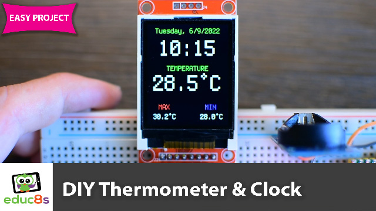

# CircuitPython Clock with DS3231 and ST7735 display
This is a Raspberry Pi Pico CicruitPython project which displays the current date & time and the Temperature on a 1.8" Color TFT display. The display is using the ST7335 driver. The date, time and temperature are provided by a DS3231 RTC module.

  

# Full Instructions Video

  

🎥 <a href="https://youtu.be/gBofy7MMdIY">Video Tutorial on YouTube</a>

 
 

| 📺 <a href="https://www.youtube.com/educ8s">YouTube</a>
| 🌍 <a href="http://www.educ8s.tv">Website</a> |  

# Parts Needed

The parts needed in order to build this project are the following:

🛒  Raspberry Pi Pico: http://educ8s.tv/part/RaspberryPiPico

🛒  Display: http://educ8s.tv/part/7735

🛒  DS3231 RTC: https://educ8s.tv/part/DS3231
